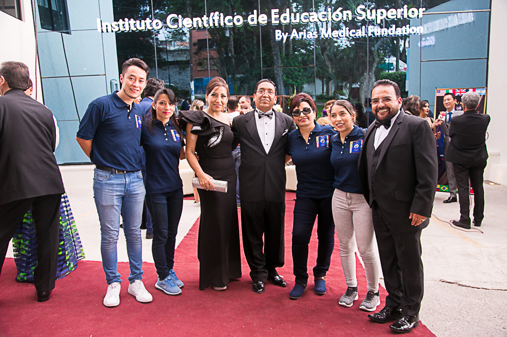
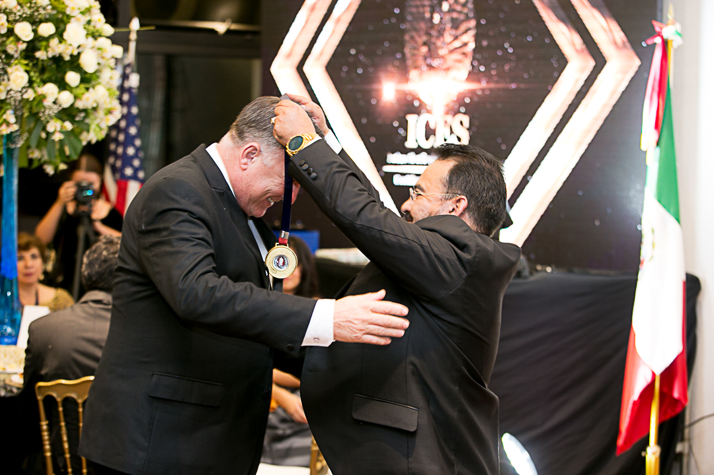
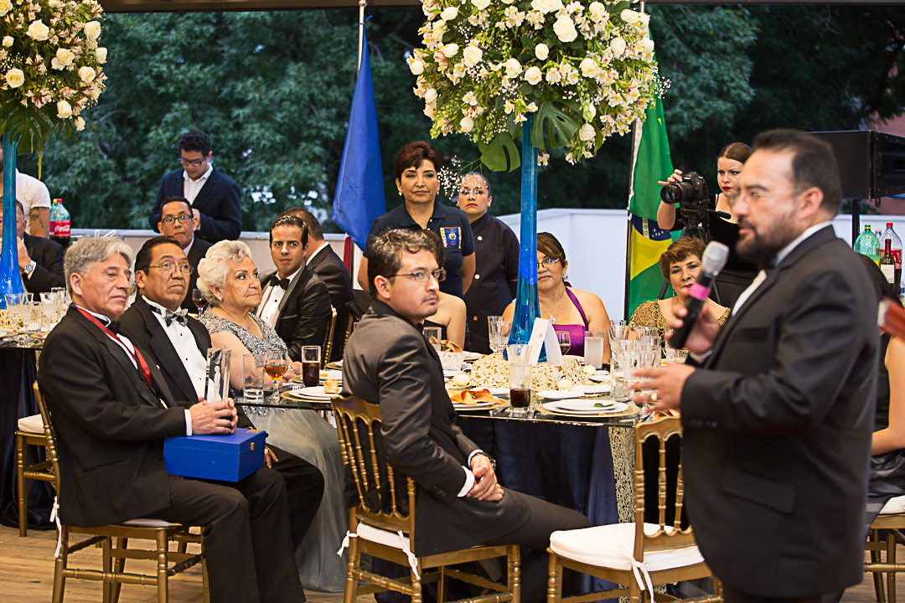
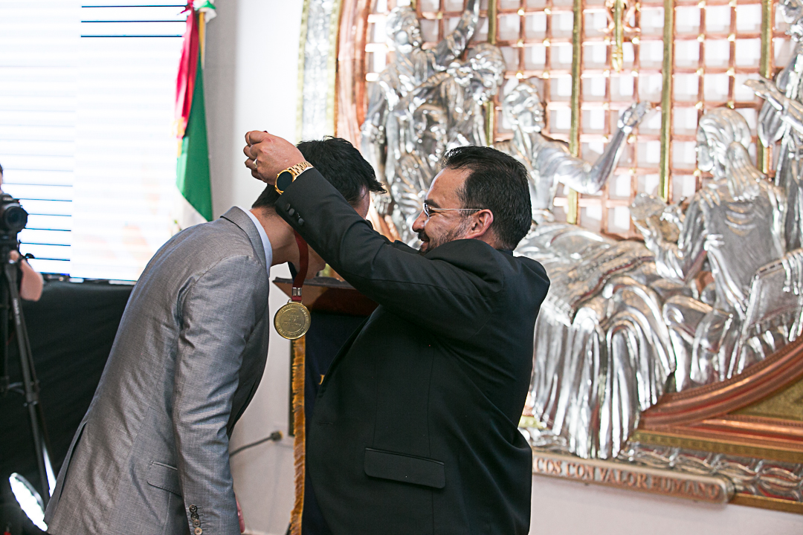

In a memorable evening that highlighted the significance of academic excellence and innovation, the Scientific Institute of Higher Education (ICES) held its annual award ceremony in 2018, recognizing the outstanding achievements of students, faculty, and researchers who have made an indelible mark on the educational and scientific landscape.

The event, hosted in the grand facilities of ICES, served not only as a platform to celebrate the year's successes but also as a meeting point for some of the brightest minds from various parts of the world. With the presence of distinguished personalities from the academic, research, and professional spheres, the award ceremony became a true melting pot of ideas and a testament to the institution's global spirit.

# A tribute to excellence

The focus of the evening was on the awards for academic excellence, where students from different disciplines were recognized for their innovative contributions and dedication to advancing knowledge. From pioneering research in biotechnology to groundbreaking developments in engineering and social sciences, the awardees demonstrated not only exceptional mastery of their fields of study but also a passion for contributing to a more promising future.

# Guests of honor and inspirational speeches

The ceremony featured several guests of honor, including renowned academics and professionals from the international scene, who shared their experiences and wisdom through inspirational speeches. These addresses not only motivated the attendees but also reaffirmed ICES's commitment to promoting an academic environment that fosters innovation, research, and excellence.

# An Event to Remember

Beyond the awards and speeches, the event was a celebration of the ICES community and its global impact. The interaction between students, professors, and international guests created a vibrant atmosphere, filled with stimulating conversations and the exchange of ideas that transcend borders. The evening was also an opportunity for ICES to demonstrate its role as a leading institution in higher education, committed not only to academic excellence but also to shaping leaders capable of tackling global challenges.

# Looking to the Future

The 2018 award ceremony at ICES was a testament to the power of education and research to change the world. By celebrating the achievements of those who have reached excellence, the event not only recognized their past contributions but also looked forward to the future with hope and anticipation for what these emerging leaders will accomplish next.